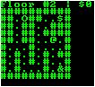

# Maze of Doom
#### Welcome, young adventurer, to the Maze of Doom. The dangers in your path are far greater than you can imagine. Reach the tallest spire as fast as you can, lest... we do not speak of the consequences here.

## Table of Contents
- [Instructions](#instructions)
- [Version History](#version-history)
- [Coming Up](#coming-up)
- [Preview Image](#preview-image)
- [System Requirements](#system-requirements)
- [Module Requirements](#module-requirements)
- [File Requirements](#file-requirements)

[REPORT BUG](https://forms.gle/cPBmojKbcK9bVbfa7)

## Instructions
Use the arrow keys and Q, W, A, S keys to move (Q, W, A, and S are for their respective diagonals). Get the key (`&`) to be able to climb up a floor using the transporters (`O`) and collect money (`$`) along the way to boost your score. Be sure to avoid lava (`%`) because it will reduce your score! Get to the top as fast as you can!

## Version History
- Release 1.0 was released on April 29th, 2019 and contains the first 5 levels of the game with a maximum possible score of 6000.
- Release 2.0 was released on May 3rd, 2019 and contains the first 10 levels of the game with a maximum possible score of 12000.

## Coming Up
Since the new update came a day later than anticipated, we had to rush to finish the last two levels and did not expand the board, yet. Release 3.0 (the next one) should be expected by May 10th, 2019 and *will* contain larger boards than 10 x 10. Expect this version to be released around **May 25th, 2019.**  
*This release date was originally May 10th, 2019. However, due to unforseen circumstances, we had to push it back ten days... Sorry for the inconvenience!*

As of May 4th, 2019, the plan for the tallest spire is for it to be on ***Floor 50***, though it will most likely change before that final version is released.

## Preview Image

*[(Can't see it?)](https://github.com/0xmmalik/Maze-of-Doom/blob/master/mazeofdoom_previewimage.JPG)*

In this image, you can see the player (`@`) is about to go get the coin (`$`) and the key (`&`), after that. 

**Note** that the font depends on the font of the terminal, and a font with the width being the same as the height is recommended, but not necessary. For the best experience, use fonts that have the same height as width!

## System Requirements
For many of my other games, Windows was not a requirement, but for this game, it *is*!

**Windows is necesssary**, and any version will suffice

**You need a faster computer**, otherwise, you will face lag and moments where the screen blinks every time you move.

## Module Requirements
- Python 3.4+ (Completely Console-Based)

## File Requirements
The `.py` file is the only file!
